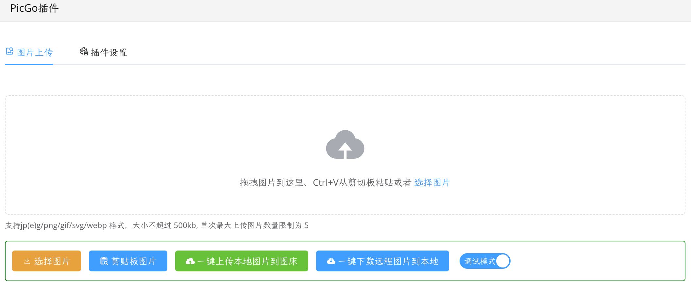

[中文](README_zh_CN.md)

# PicGo Plugin



Your favorite PicGo image bed is still available in siyuan-notes, wuhu~

## Recommended Configuration

Breaking News!Using MinIO with the PicGo plugin is recommended, if you don't know how, I've written a step-by-step guide with screenshots, [click here to view](https://siyuan.wiki/s/20241129133646-lz08gnl).

## Version Compatibility

> Important Note:
>
> Please refrain from updating this plugin for versions of siyuan-note prior to `3.0.3`; the highest permissible version remains `1.5.1`. For siyuan-note versions `3.0.3` and beyond, the PicGO plugin may be upgraded to `1.6.0+`.
>
> For versions of siyuan-note before `2.10.8`, it is advised not to upgrade this plugin beyond version `1.4.5`. Subsequent to siyuan-note `2.10.8`, the PicGO plugin can be updated to `1.5.0+`.

## Image Hosting Support

- Github<sup>recommended</sup>
- Gitlab<sup>recommended</sup>
- Alibaba Cloud
- Tencent Cloud
- Upyun
- Qiniu Cloud<sup>recommended</sup>
- SM.MS
- imgur
- Amazon S3<sup>recommended</sup>, thanks to [@hzj629206](https://github.com/hzj629206)
- Lsky pro<sup> v1.11.0+</sup>

## Config paths

### v2.0.0

v2.0.0 is a breaking cleanup release. It includes the internal PicGo refactor and the storage path split.

The bundled PicGo main config is synced with the SiYuan workspace:

```text
[workspace]/data/storage/syp/picgo/
  picgo.cfg.json
```

Device-local runtime files stay outside workspace sync:

```text
~/.universal-picgo/
  external-picgo-cfg.json
  package.json
  package-lock.json
  node_modules/
  libs/
  i18n-cli/
  picgo-clipboard-images/
  mac.applescript / windows.ps1 / windows10.ps1 / linux.sh / wsl.sh
  picgo.log
```

Migration rule: if the workspace `picgo.cfg.json` is missing and `~/.universal-picgo/picgo.cfg.json` exists, v2 copies only that single file to the workspace. It does not delete the home file, does not overwrite an existing workspace config, and does not move the whole directory.

### Historical paths

```text
<= 1.5.6
[workspace]/data/storage/syp/picgo/picgo.cfg.json
[workspace]/data/storage/syp/picgo/external-picgo-cfg.json
[workspace]/data/storage/syp/picgo/package.json
[workspace]/data/storage/syp/picgo/package-lock.json
[workspace]/data/storage/syp/picgo/node_modules/
[workspace]/data/storage/syp/picgo/libs/
[workspace]/data/storage/syp/picgo/i18n-cli/
[workspace]/data/storage/syp/picgo/picgo-clipboard-images/
[workspace]/data/storage/syp/picgo/*.script
[workspace]/data/storage/syp/picgo/picgo.log

1.6.0+
~/.universal-picgo/picgo.cfg.json
~/.universal-picgo/external-picgo-cfg.json
~/.universal-picgo/package.json
~/.universal-picgo/package-lock.json
~/.universal-picgo/node_modules/
~/.universal-picgo/libs/
~/.universal-picgo/i18n-cli/
~/.universal-picgo/picgo-clipboard-images/
~/.universal-picgo/*.script
~/.universal-picgo/picgo.log
```

## Changelog

Please refer to [CHANGELOG](https://github.com/terwer/siyuan-plugin-picgo/blob/main/CHANGELOG.md)

## Donate

If you approve of this project, invite me to have a cup of coffee, which will encourage me to keep updating and create more useful tools~

### WeChat

<div>

</div>

### Alipay

<div>

</div>

## Related Items

- [sy-picgo-core](https://github.com/terwer/sy-picgo-core)
- [Electron-PicGo-Core](https://github.com/terwer/Electron-PicGo-Core)
- [picgo-plugin-watermark-elec](https://github.com/terwer/picgo-plugin-watermark-elec)

## Thanks

Thanks to the solutions provided by the open source community, which simplifies a lot of work for this project!

- [PicGo-Core](https://github.com/PicGo/PicGo-Core)
- [PicList](https://github.com/Kuingsmile/PicList)
