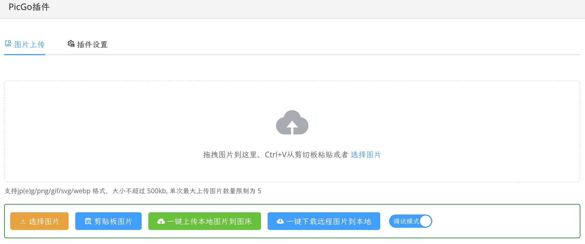

[English](README.md)

# PicGo插件

您喜爱的 PicGo 图床与 PicGo 插件，在思源笔记依然可用，没想到吧~

> 重要提示：
> 
> 思源笔记 `2.10.8` 之前的版本请不要升级本插件，最高只能使用使用 `1.4.5` 版本。
> 
> 思源笔记 `2.10.8` 之后的版本可升级 PicGO 插件到 `1.5.0+` 。

## 更新历史

请参考 [CHANGELOG](https://github.com/terwer/siyuan-plugin-picgo/blob/main/CHANGELOG.md)

## 捐赠

如果您认可这个项目，请我喝一杯咖啡吧，这将鼓励我持续更新，并创作出更多好用的工具~

### 微信

### 支付宝

## 相关项目

- [sy-picgo-core](https://github.com/terwer/sy-picgo-core)
- [Electron-PicGo-Core](https://github.com/terwer/Electron-PicGo-Core)
- [picgo-plugin-watermark-elec](https://github.com/terwer/picgo-plugin-watermark-elec)

## 感谢

感谢来自开源社区提供的解决方案，简化了本项目的不少工作！

- [PicGo-Core](https://github.com/PicGo/PicGo-Core)